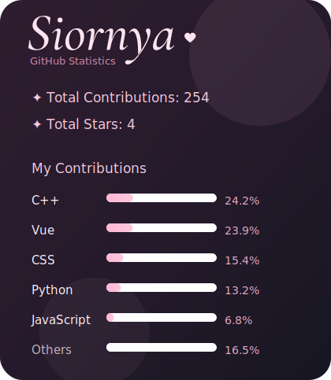

<h1 align="center">Hi ~ I'm 沧灵诗Siornya</h1>

## About

信奥出身，现在在打ICPC，不用重生也是菜狗，算是会一些C++

对游戏行业很感兴趣，所以目前主研UE5

随机触发制作游戏mod形态，做过Minecraft和StS的mod

平时还会搓搓个人空间，偶尔做一下Bot

## Tech Stack

以下大致是常用技术栈

**Game Development**    

**Frontend**    

**Bot**  

## Github

## More

*profile仓库经历两次消失两次复活，终于第三次上线了*

如果有任何想法，非常欢迎和我交流

此外，个人空间入口在这里 [「Siornya の『十字路口』」](https://siornya.cafe)

---

以上，希望你会喜欢我和我的作品 🌸

*Thanks for visiting. Hope you find your own fantastic life.*

*感谢访问，希望你能找到那如同幻想曲般的人生。*

